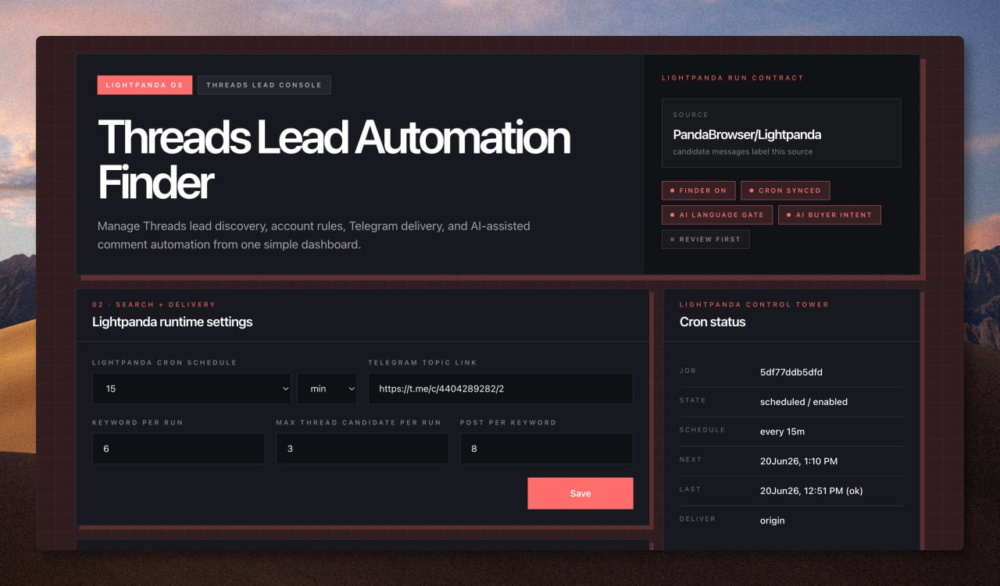

# Threads Lead Automation Finder

Lightpanda + Hermes Agent automation for finding Threads leads, managing multiple Threads accounts, sending Telegram review cards, and drafting AI-assisted replies from a simple dashboard.



## What this repo gives you

This project is designed for a VPS or always-on Linux machine running [Hermes Agent](https://hermes-agent.nousresearch.com/). It helps you:

- search Threads by per-account keywords
- rotate through keywords on a cron schedule
- filter candidates with AI language / buyer-intent checks
- send candidate review cards to a Telegram topic
- generate fresh AI replies from the full captured post/thread context
- approve replies manually with Telegram buttons
- keep unattended submit OFF while still allowing human-approved replies
- manage account settings from a Next.js dashboard

The original use case in this repo includes:

- property lead discovery account example: `@koiisss_`
- n8n/course promotion account example: `@zakwan77__`

You can replace those with your own Threads accounts, keywords, guidelines, CTA text, and Telegram topic.

## Repository layout

| Path | Purpose |
|---|---|
| `dashboard/` | Next.js dashboard for runtime settings, account cards, Telegram callback route, and account controls. |
| `lightpanda-threads/` | Lightpanda finder, SQLite store, cookie import tools, monitor page, and tests. |
| `scripts/lightpanda_threads_cron.py` | Thin Hermes cron wrapper. |
| `docs/database-setup.md` | How to recreate the SQLite DB on another machine. |
| `docs/windows-terminal-login.md` | VPS-safe login flow using a Windows laptop + terminal + Playwright. |
| `docs/hermes-telegram-gateway-manual-reply-patch.md` | Notes for the Hermes Telegram gateway patch used by `Lily` / `Me` buttons. |
| `docs/assets/dashboard-preview.jpg` | Dashboard screenshot used in this README. |

## What is intentionally not included

This repo is sanitized and public-safe. It does **not** include live local secrets or runtime state:

- `.env`
- Telegram bot token
- GitHub token
- Hermes `auth.json`
- Threads cookies / browser storage state
- SQLite DB files
- session state, logs, screenshots, PID/lock files
- `node_modules`, `.next`, Lightpanda binary cache

These files must be created locally on your own machine/VPS.

## Requirements

Recommended environment:

- Linux VPS or server
- Python 3.11+
- Node.js 20+
- npm
- Hermes Agent installed and configured
- Telegram bot connected to Hermes gateway
- Lightpanda binary available locally
- Optional: GitHub CLI if you want to push changes back to GitHub

The code assumes the original Hermes-style paths by default:

```text
/root/.hermes/dashboard
/root/.hermes/lightpanda-threads
```

You can either use those paths or update config paths in the JSON/source files.

## Quick install on a new Hermes VPS

Clone the repo:

```bash
git clone https://github.com/kuwe77/ThreadLeadAutomation.git
cd ThreadLeadAutomation
```

Create the expected Hermes directories and symlink this repo into place:

```bash
mkdir -p /root/.hermes
ln -sfn "$PWD/dashboard" /root/.hermes/dashboard
ln -sfn "$PWD/lightpanda-threads" /root/.hermes/lightpanda-threads
```

Install dashboard dependencies:

```bash
cd dashboard
npm install
npm run build
cd ..
```

Create local runtime directories:

```bash
mkdir -p dashboard/state/auth
mkdir -p dashboard/state/threads-recent-topic-flow
mkdir -p lightpanda-threads/state/cookies
mkdir -p lightpanda-threads/state/finder-runs
```

Initialize the SQLite DB:

```bash
cd lightpanda-threads
python3 scripts/sqlite_store.py init
python3 scripts/sqlite_store.py migrate
python3 scripts/sqlite_store.py stats
cd ..
```

See the detailed guide: [`docs/database-setup.md`](docs/database-setup.md).

## Configure accounts

Main config file:

```text
lightpanda-threads/finder_config.json
```

Each account can have its own:

| Field | Meaning |
|---|---|
| `label` | Display name, e.g. `@my_account`. |
| `handle` | Threads handle without `@`. |
| `enabled` | Whether cron/search scans this account. |
| `keywords` | Search terms for this account. |
| `commentGuideline` | AI instruction for fresh reply drafting. |
| `includeCta` | Whether to append/use CTA. |
| `ctaText` | CTA line, e.g. `klik link kt bio kalau berminat ttg n8n`. |
| `autoCommentEnabled` | Let automation draft AI replies for review. |
| `commentSubmitEnabled` | Allow unattended submit. Keep this OFF unless you really want full auto-submit. |

Recommended safe setup:

```text
cron/search: ON
auto-comment: ON
submit: OFF
```

That means the system finds leads and drafts replies, but posting still requires a human to approve in Telegram.

## Threads login / cookies from a Windows laptop

For a VPS, the easiest login method is the terminal-only Playwright receiver flow.

Start receiver on the VPS for the target account:

```bash
cd /root/.hermes/lightpanda-threads
python3 scripts/threads_cookie_receiver.py \
  --host 0.0.0.0 \
  --port 8765 \
  --account threads-2 \
  --public-base http://YOUR_VPS_OR_TAILSCALE_IP:8765
```

It prints a one-time script URL.

On the Windows laptop, run the generated PowerShell command. The command downloads `windows-login.js`, installs Playwright, opens a browser, lets the user login to Threads, then uploads cookies back to the VPS.

After upload, expected files are created:

```text
/root/.hermes/dashboard/state/auth/cms-threads-account-2.json
/root/.hermes/lightpanda-threads/state/cookies/threads-2.lightpanda.cookies.json
/root/.hermes/lightpanda-threads/state/cookies/threads-2.lightpanda.session.cookies.json
```

Full guide: [`docs/windows-terminal-login.md`](docs/windows-terminal-login.md).

## Run the dashboard

This repo includes the dashboard source, but process management is intentionally left to your VPS/Hermes setup.

Typical local test:

```bash
cd dashboard
npm run build
npm start
```

If you use systemd, create a service that runs the built Next.js app on your desired host/port, for example port `5001`.

Dashboard page:

```text
http://YOUR_HOST:5001/lightpanda-threads
```

The dashboard lets you edit:

- cron interval
- Telegram topic link
- keywords per run
- max candidates per account/run
- posts per keyword
- per-account username/handle
- per-account keywords
- per-account AI guideline
- per-account CTA
- per-account cron/search, auto-comment, submit toggles

## Telegram review flow

Candidate messages go to your configured Telegram topic. The intended minimal action set is:

| Button | Meaning |
|---|---|
| `Lily` | Let AI draft/send the reply as a human-approved action. |
| `Me` | You type the exact reply, then the gateway posts it. |

Important safety rule:

- `submit OFF` blocks unattended/full-auto posting.
- `Lily` / `Me` are human approvals and can post with a force/manual override.

For the `Me` button to consume your next Telegram message correctly, the live Hermes Telegram gateway needs the patch described here:

[`docs/hermes-telegram-gateway-manual-reply-patch.md`](docs/hermes-telegram-gateway-manual-reply-patch.md)

## Configure Hermes cron

The cron wrapper is:

```text
scripts/lightpanda_threads_cron.py
```

Create a Hermes no-agent cron job pointing to it. Example conceptually:

```text
name: Lightpanda Threads Finder
schedule: every 15m
workdir: /root/.hermes/lightpanda-threads
script: lightpanda_threads_cron.py
no_agent: true
```

The wrapper calls:

```bash
python3 scripts/lightpanda_threads_finder.py --config finder_config.json --all
```

Useful environment overrides:

| Env var | Meaning |
|---|---|
| `LIGHTPANDA_MAX_KEYWORDS=1` | Limit keywords for a smoke test. |
| `LIGHTPANDA_MAX_CANDIDATES=1` | Limit candidates for a smoke test. |
| `LIGHTPANDA_NO_SEND=1` | Run without sending Telegram messages. |

Smoke test:

```bash
cd /root/.hermes/lightpanda-threads
LIGHTPANDA_NO_SEND=1 LIGHTPANDA_MAX_KEYWORDS=1 LIGHTPANDA_MAX_CANDIDATES=1 python3 scripts/lightpanda_threads_cron.py
```

Check latest status:

```bash
python3 -m json.tool state/status.json
python3 -m json.tool state/cron-last-summary.json
```

## Database

The SQLite database is recreated locally and should not be committed.

Default DB path:

```text
lightpanda-threads/state/lightpanda_threads.db
```

Create it:

```bash
cd lightpanda-threads
python3 scripts/sqlite_store.py init
python3 scripts/sqlite_store.py migrate
python3 scripts/sqlite_store.py stats
```

Tables include:

- `settings`
- `accounts`
- `runs`
- `run_accounts`
- `candidates`
- `seen_posts`
- `telegram_actions`
- `cron_state`
- `event_logs`

Detailed guide: [`docs/database-setup.md`](docs/database-setup.md).

## Example n8n/course promotion account

This repo includes an example account configured for n8n course promotion.

Example CTA:

```text
klik link kt bio kalau berminat ttg n8n
```

Example keyword themes:

- `n8n`
- `belajar n8n`
- `kelas n8n`
- `n8n automation`
- `workflow automation`
- `business automation`
- `automasi bisnes`
- `AI automation`
- `no code automation`
- `whatsapp automation`
- `CRM automation`
- `zapier alternative`
- `make.com alternative`

Replace these with your own niche and offer.

## Security checklist before making your fork public

Before pushing your own version publicly, make sure you did not commit:

```bash
git status --short
```

Check for sensitive files:

```bash
find . -type f \
  \( -name '*.cookies.json' -o -name '*.db' -o -name '.env' -o -name '*auth*.json' \) \
  -not -path './.git/*'
```

This repo’s `.gitignore` excludes common dangerous files, but always verify manually.

## For another AI agent

If you give this repo to another agent, tell it to read these first:

1. [`README.md`](README.md)
2. [`docs/database-setup.md`](docs/database-setup.md)
3. [`docs/windows-terminal-login.md`](docs/windows-terminal-login.md)
4. [`docs/hermes-telegram-gateway-manual-reply-patch.md`](docs/hermes-telegram-gateway-manual-reply-patch.md)

Then ask it to:

1. clone the repo
2. symlink/copy it into the Hermes paths
3. install dashboard dependencies
4. create the SQLite DB
5. configure Telegram/Hermes secrets locally
6. run the Windows terminal login flow for each Threads account
7. set account keywords/guidelines/CTA
8. create or resume the Hermes cron job
9. smoke-test with `LIGHTPANDA_NO_SEND=1`

## License / responsibility

Use responsibly. Respect platform rules, rate limits, and local laws. Keep submit OFF unless you intentionally want fully unattended posting.
